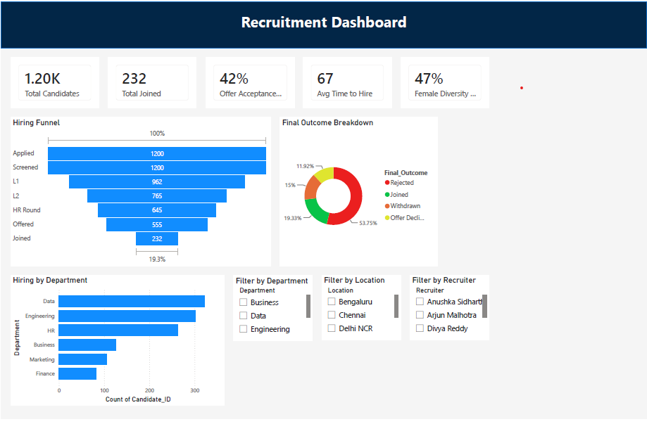
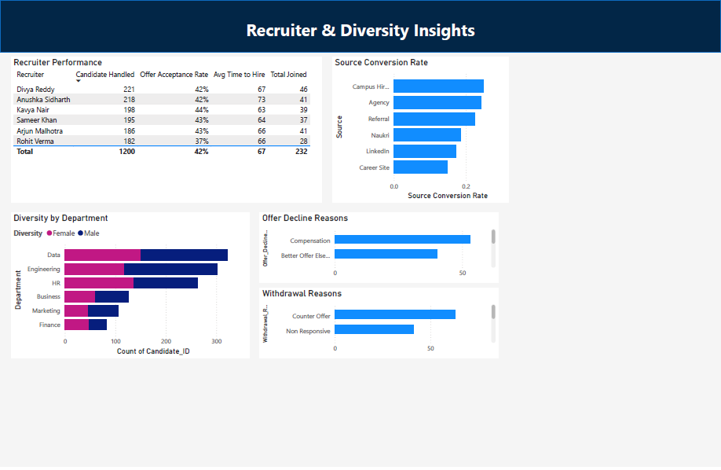

# 📊 Enterprise Recruitment Analytics Dashboard


---

## 🏢 Project Overview

The **Enterprise Recruitment Analytics Dashboard** is an interactive Power BI project designed to analyze an end to end recruitment pipeline. It provides actionable insights into hiring performance, recruiter productivity, sourcing effectiveness, diversity metrics, and recruitment funnel efficiency using Power BI, DAX, Power Query, and Excel.

---

## 📸 Dashboard Preview

### Executive Overview



### Recruiter & Diversity Insights



---

## 🎯 Business Problem

Recruitment teams often manage large volumes of hiring data across recruiters, departments, locations, and sourcing channels. Without centralized reporting, it becomes difficult to measure hiring performance and identify opportunities for improvement.

This dashboard provides a single view of recruitment KPIs to support faster and more informed hiring decisions.

---

## 📈 Key Features

- Executive recruitment KPI dashboard
- Recruitment funnel analysis
- Recruiter performance tracking
- Department wise hiring analysis
- Source conversion analysis
- Diversity hiring insights
- Offer acceptance analysis
- Offer decline and withdrawal reason analysis
- Interactive filters for recruiter, department, and location

---
## 📊 Dashboard Pages

### 1. Executive Overview

Provides a high level summary of the recruitment process through key hiring metrics, recruitment funnel analysis, department wise hiring trends, and interactive filters for recruiter, department, and location.

### 2. Recruiter & Diversity Insights

Focuses on recruiter performance, source conversion rates, diversity hiring across departments, offer decline reasons, and candidate withdrawal analysis to support better recruitment decisions.

---

## 🛠️ Tools & Technologies

- Microsoft Power BI
- DAX (Data Analysis Expressions)
- Power Query
- Microsoft Excel
- Data Modeling
- Interactive Data Visualization

---

## 💼 Skills Demonstrated

- Recruitment Analytics
- HR Dashboard Development
- Business Intelligence
- KPI Reporting
- Data Visualization
- DAX Measures
- Power Query (ETL)
- Data Modeling
- Executive Reporting
- Analytical Problem Solving

---

## 📁 Repository Structure

```text
Enterprise-Recruitment-Analytics-Dashboard
│
├── Dashboard/
│   └── Recruitment_Analytics_Dashboardv2.pbix
│
├── Dataset/
│   └── Enterprise_Recruitment_Dataset_v2.xlsx
│
├── Screenshots/
│   ├── executive_overview.png
│   └── recruiter_diversity_insights.png
│
├── README.md
├── LICENSE
└── .gitignore
```

---

## 🚀 How to Use

1. Download the `.pbix` file from the **Dashboard** folder.
2. Open the file using Microsoft Power BI Desktop.
3. If required, reconnect the dataset located in the **Dataset** folder.
4. Explore the interactive dashboards using the available filters.

---

## 👩‍💼 About the Author

**Anushka Sidharth**

Talent Acquisition professional with 3+ years of experience, passionate about combining recruitment expertise with data analytics to build dashboards that support data driven hiring decisions.

**If you found this project useful, feel free to star ⭐ the repository.**
